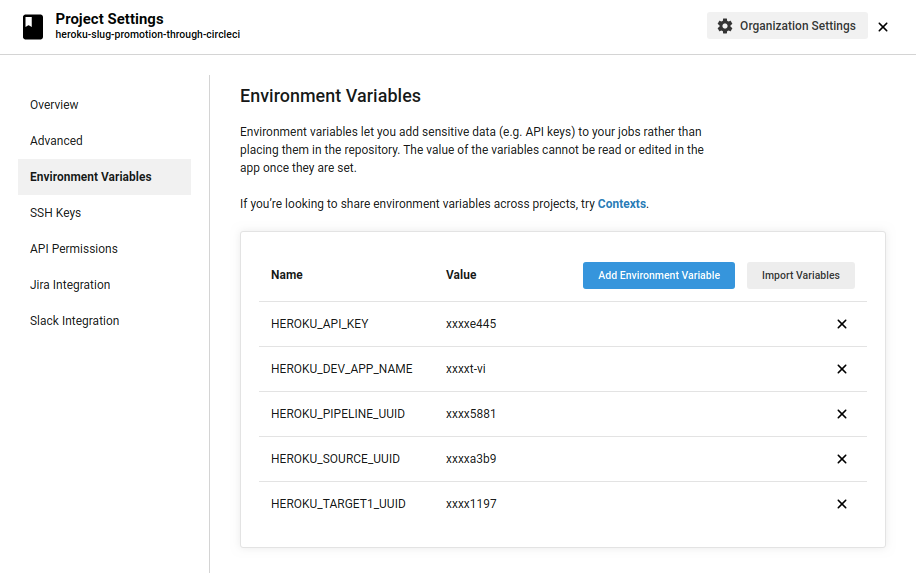
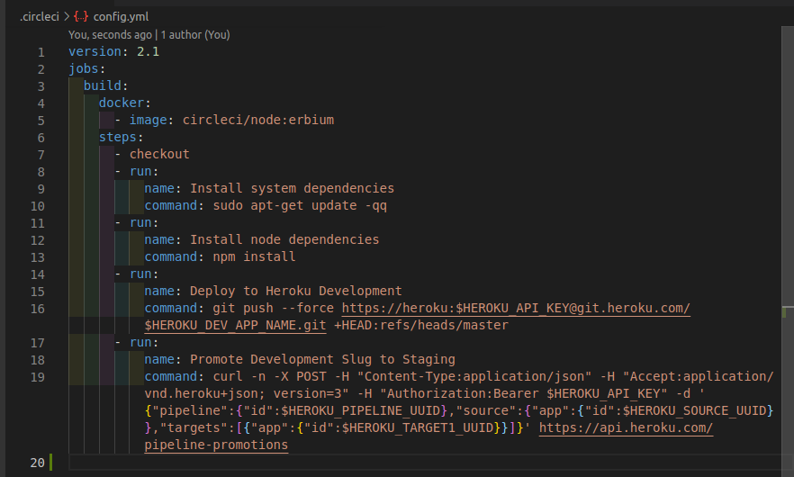

# heroku-slug-promotion-through-circleci

## How to get HEROKU_API_KEY
### Method 1
1. Install Heroku CLI
2. Login to Heroku
    1. Open terminal
    2. Write `heroku login`
    3. It'll open browser, login in browser using heroku credentials
    4. On successful authentication, terminal will say `Logged in as youremail@emaildomain.com`
3. Write `heroku auth:token`, it'll print heroku token 
### Method 2
1. Open https://www.heroku.com in browser and login
2. Go to [account settings](https://dashboard.heroku.com/account)
3. Scroll down and locate API Key, click on `Reveal` button
4. Copy the value as `HEROKU_API_KEY`

## Curl request to create Heroku Apps, and get HEROKU_SOURCE_UUID/HEROKU_TARGET1_UUID
1. Write following in terminal
```
curl -n -X POST https://api.heroku.com/apps \
  -d '{
  "name": "dev-app-name",
  "region": "eu",
  "stack": "heroku-18"
}' \
  -H "Content-Type: application/json" \
  -H "Accept: application/vnd.heroku+json; version=3" \
  -H "Authorization:Bearer HEROKU_API_KEY"
```
2. It'll give following response
```
{
  "acm":false,
  "archived_at":null,
  "buildpack_provided_description":null,
  "build_stack":{
    "id":"69bee368-352b-4bd0-9b7c-819d860a2588",
    "name":"heroku-18"
  },
  "created_at":"2021-01-07T18:18:02Z",
  "id":"f2f490f7-126e-46b0-a583-a9ef614a1954",
  "git_url":"https://git.heroku.com/dev-app-name.git",
  "maintenance":false,
  "name":"dev-app-name",
  "owner":{
    "email":"youremail@emaildomain.com",
    "id":"ba92148a-456c-41bd-962f-46fca2bdff4a"
  },
  "region":{
    "id":"ed30241c-ed8c-4bb6-9714-61953675d0b4",
    "name":"eu"
  },
  "organization":null,
  "team":null,
  "space":null,
  "internal_routing":null,
  "released_at":"2021-01-07T18:18:02Z",
  "repo_size":null,
  "slug_size":null,
  "stack":{
    "id":"69bee368-352b-4bd0-9b7c-819d860a2588",
    "name":"heroku-18"
  },
  "updated_at":"2021-01-07T18:18:02Z",
  "web_url":"https://dev-app-name.herokuapp.com/"
}

```
3. Copy `id` as `HEROKU_SOURCE_UUID` and `owner.id` as `USER_UUID`
4. Replace `dev-app-name` with `stage-app-name`, and run step 1 command in terminal
5. Copy its `id` as `HEROKU_TARGET1_UUID`

## Curl request to create Heroku Pipeline, and get HEROKU_PIPELINE_UUID
1. Write following in terminal
```
curl -n -X POST https://api.heroku.com/pipelines \
  -d '{
  "name": "pipeline-name",
  "owner": {
    "id": USER_UUID,
    "type": "user"
  }
}' \
  -H "Content-Type: application/json" \
  -H "Accept: application/vnd.heroku+json; version=3" \
  -H "Authorization:Bearer HEROKU_API_KEY"
```
2. It'll give following response
```
{"created_at":"2021-01-07T18:12:13Z","id":"c4efd464-9f89-4e43-98d0-b495b1577887","name":"pipeline-name","updated_at":"2021-01-07T18:12:13Z","owner":null}
```
3. Copy value against `id` as `HEROKU_PIPELINE_UUID`

## Add the created Apps to Heroku Pipeline
1. Open browser and go to https://dashboard.heroku.com/pipelines/HEROKU_PIPELINE_UUID
2. Click on `Add app` next to STAGING, then search for `dev-app-name`, choose it from dropdown
3. Click on button next to `Open app`, then click on `Move app to development`
4. Now again click on `Add app` next to STAGING, then search for `stage-app-name`, choose it from dropdown

## Circle CI Setup
1. Login Circle CI
2. Setup/Follow project
3. Go to project settings and setup following values in environment variables of the project


## .circleci/config.yml
1. Make a folder in root directory of the repo named `.circleci`, and create a file named `config.yml`
2. Following is sample `config.yml` file. Last step is the command to promote the already built slug of Development environment to Staging environment

3. Commit to github, and let the magic happen